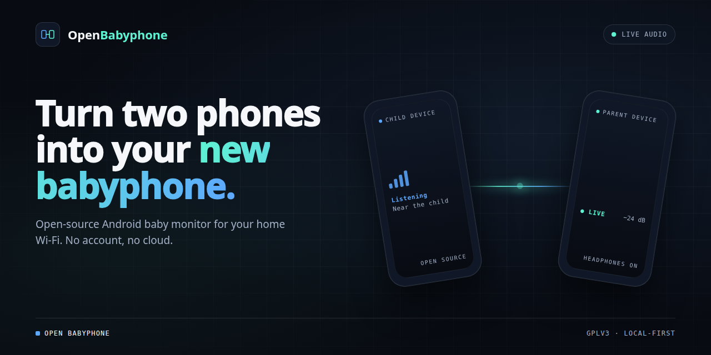

# Open Babyphone

<p align="center">
  
</p>

<p align="center">
  <a href="https://github.com/digitalesIch/open-babyphone/actions/workflows/ci.yml"></a>
  <a href="LICENSE"></a>
  <a href="#requirements"></a>
</p>

Open Babyphone is an open-source Android baby monitor for local networks. It
turns two Android devices into a simple audio monitor for home use: one device
stays near the child and streams microphone audio, the other stays with the
parent and plays the stream.

The normal setup is same Wi-Fi or the same local network. Open Babyphone is
built for straightforward in-home use, source-code transparency, and setup
without accounts or project-operated servers. Advanced users can also connect
through trusted VPN or unusual LAN setups with manual address entry.

## Features

- Local-network audio streaming between Android devices
- Same-Wi-Fi discovery with Android Network Service Discovery (NSD)
- QR code scanning or manual pairing-code entry on the parent device
- Manual address entry for trusted VPNs or unusual local-network setups
- Wi-Fi Direct (experimental) for direct device-to-device connection without an
  existing Wi-Fi network
- Strong alphanumeric pairing code generated by default on the child device
- Challenge-response parent authentication with Argon2i key derivation
- ChaCha20-Poly1305 encrypted audio frames when a pairing code is configured
- Protocol versioning and capability negotiation for future codec migration
- Multi-parent listening from one child device, with up to 5 parent devices
- Parent-side reconnect behavior and a small jitter buffer
- Trusted child pairing: parents remember known children and reconnect without re-scanning
- Microphone sensitivity control on the child device (Normal, High, Very high)
- Open Design brand UI with cyan/blue accent palette and paired-phones brand mark
- GitHub Actions CI for release build, unit tests, and Android lint
- Unit and instrumentation tests for codec, framing, crypto, jitter buffer,
  handshake, and client management

## Project Status

Open Babyphone is in active development. The core child/parent audio monitor is
implemented, and the current milestone is focused on real-device reliability:
screen-off operation, overnight runs, network interruptions, foreground service
behavior, and audio output edge cases.

Treat the app as pre-beta software until the reliability matrix has been run on
real devices and release packaging is complete. See [ROADMAP.md](ROADMAP.md) for
the detailed plan.

## Scope

Open Babyphone is designed for local audio monitoring at home. It is not a
medical or safety-certified device, or a replacement for responsible supervision.

Video mode is a possible future local-only addition, not part of the current
release scope.

Internet-based remote monitoring, hosted relay infrastructure, accounts, push
services, and recurring SaaS dependencies are outside the current product scope.
The goal is a small, understandable app that works well on a local network and
can be reviewed, built, and improved by the open-source community.

## How It Works

1. Start Open Babyphone on the child device and choose **Use as Child Device**.
2. The child device generates a pairing code and displays it with a QR code.
3. The child device advertises itself on the local network and listens for
   parent connections, starting at TCP port `10000`.
4. Start Open Babyphone on the parent device and choose **Use as Parent Device**.
5. Select the discovered child device, or enter its address and port manually
   under the advanced path.
6. Scan the QR code shown on the child device, or enter the pairing code
   manually to enable authentication and encrypted transport.
7. The parent connects and plays the child device's audio stream.

If no shared Wi-Fi network is available, both devices can use the experimental
Wi-Fi Direct connection instead. The child device starts a Wi-Fi Direct group
from the monitoring screen; the parent device discovers and connects to it under
the advanced path.

Manual address entry is available under the advanced path for trusted VPNs or
networks where automatic discovery is not available.

During connection setup, the child and parent negotiate protocol version and
codec capabilities. If a client is incompatible, the connection is rejected
cleanly instead of producing broken audio.

An empty pairing code disables authentication and encrypted transport. This is
available for special local setups, but it is not the default. Use the generated
pairing code for normal operation.

## Multi-Parent Support

Up to 5 parent devices can listen to the same child device at the same time on
the local network. The child device records from the microphone once and fans out
encoded audio frames to connected parents. If one parent device cannot keep up,
the child drops that connection without blocking the others.

## Requirements

- Android 11 (R) or newer, SDK 30+
- Two Android devices on the same Wi-Fi or local network
- Microphone permission on the child device
- Camera permission on the parent device for QR code scanning, if used
- Notification permission on Android 13+ for foreground service notifications
- A local network both devices can reach; trusted VPN is an advanced fallback
- Wi-Fi Direct support is optional and not available on all devices

## Without Existing Wi-Fi

Open Babyphone does not need internet access, but both devices need a local
network path between them. If there is no existing Wi-Fi network, Android hotspot
mode can often provide that local connection. The experimental Wi-Fi Direct
connection is another option that does not require a separate hotspot.

### Wi-Fi Direct (Experimental)

When both devices support Wi-Fi Direct, the child device can start a direct
connection from the monitoring screen. The parent device searches for nearby
child devices under the advanced path and connects directly via Wi-Fi Direct.
Audio and pairing work the same way as over a local Wi-Fi network.

Wi-Fi Direct is OEM- and ROM-dependent. If discovery or connection fails, use a
Wi-Fi hotspot or manual address entry instead.

### Child Device Hotspot

The child device can create a Wi-Fi hotspot in Android settings. The parent
device joins that hotspot and connects to Open Babyphone as usual.

- The child device does not need a SIM card for Open Babyphone itself.
- Whether Android allows hotspot mode without a SIM card depends on the device
  and ROM.
- If the child device has no internet uplink, the hotspot can still work as a
  local network for Open Babyphone.
- Keep the child device plugged in when possible because hotspot, microphone,
  and streaming increase power use.

### Parent Device Hotspot

The parent device can create the hotspot instead. The child device joins that
hotspot, and Open Babyphone still communicates locally.

- This can be practical when the parent device has a SIM card and keeps mobile
  data available while hosting the hotspot.
- The child device does not need a SIM card.
- Both devices must remain within range of the local wireless link.

WiFi Direct is experimental and OEM/ROM-dependent. If discovery or connection
fails, use a Wi-Fi hotspot or manual address entry instead.

## Building From Source

Use the checked-in Gradle wrapper and JDK 21:

```bash
./gradlew assembleRelease testReleaseUnitTest lintRelease
```

Useful focused checks:

```bash
./gradlew assembleRelease
./gradlew testReleaseUnitTest
./gradlew assembleDebugAndroidTest
./gradlew lintRelease
```

Release signing is intentionally not configured in the repository. Do not commit
keystores, passwords, or signing secrets.

## Privacy And Security

Open Babyphone sends audio directly from the child device to connected parent
devices on the local network. It does not send app data to project-operated
services.

Security-relevant behavior:

- A strong alphanumeric pairing code is generated by default on the child device.
- A non-empty pairing code enables challenge-response authentication with
  Argon2i key derivation.
- A non-empty pairing code also enables ChaCha20-Poly1305 encrypted audio frames.
- An empty pairing code means open local connections and unencrypted audio.
- The child and parent negotiate protocol version and codec capabilities during
  the handshake.
- Android backup is disabled so pairing data is not copied through app backup.

See the full [privacy policy](privacy-policy.md) and [security policy](SECURITY.md)
for details about the app's data handling and security model.

## Roadmap

The current strategic and operational roadmap is tracked in the GitHub Project:

https://github.com/digitalesIch/open-babyphone/projects

The current work focuses on making the app reliable and easy to use before broad
public distribution:

- Prove overnight reliability on real devices
- Improve child/parent setup and status screens
- Finish the Material UX refresh
- Keep pairing and encrypted transport as the normal flow
- Finalize F-Droid metadata, release notes, and signing documentation

[ROADMAP.md](ROADMAP.md) is kept as a historical planning archive, not as the
active roadmap source of truth.

## Contributing

Contributions are welcome. Please keep changes aligned with the local-network
product direction and read [CONTRIBUTING.md](CONTRIBUTING.md) before opening a
pull request.

For security issues, do not open a public issue. Follow [SECURITY.md](SECURITY.md).

## Fork History And Attribution

Open Babyphone is an independent fork of [Child Monitor](https://github.com/enguerrand/child-monitor),
which itself is a fork of [Protect Baby Monitor](https://github.com/brarcher/protect-baby-monitor).
The original projects remain credited and licensed under GPLv3.

Audio file originals are from [freesound](https://freesound.org).

## License

Open Babyphone is licensed under the GPLv3. See [LICENSE](LICENSE).

The G.711 u-law codec code is derived from the Android Open Source Project and is
licensed under the Apache License, Version 2.0.
