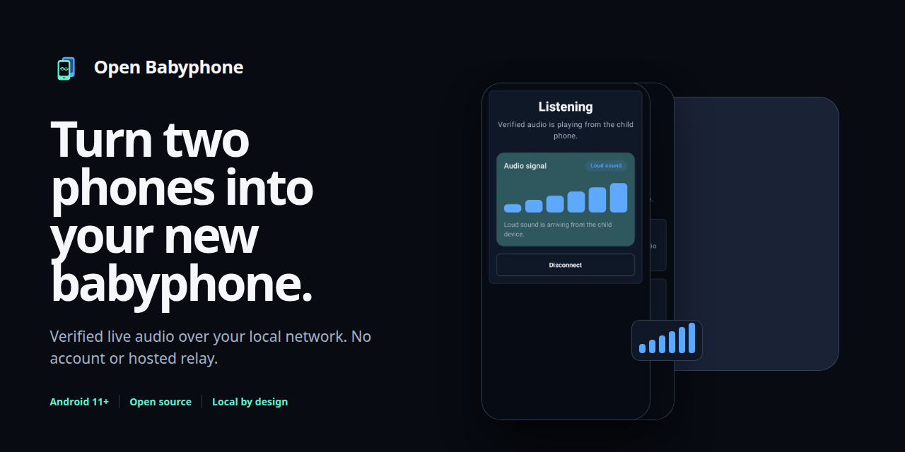

# Open Babyphone

<p align="center">
  
</p>

<p align="center">
  <a href="https://github.com/digitalesIch/open-babyphone/actions/workflows/ci.yml"></a>
  <a href="LICENSE"></a>
  <a href="#requirements"></a>
</p>

Open Babyphone turns Android devices into a local audio baby monitor. One device
stays near the child and sends microphone audio directly to a paired parent
device over a local network.

The project is open source and local by design. Normal use requires no account,
cloud service, or project-operated server.

## Why Open Babyphone

- **Local by design:** audio travels directly between devices on a local network.
- **Private by default:** pairing and authenticated encrypted transport protect
  the supported connection flow.
- **No account required:** setup and operation do not depend on a hosted backend.
- **Open and auditable:** the app, its protocol, and its development process are
  available for public review.

## How It Works

1. Start child mode on the device placed near the child.
2. Pair a parent device over the same Wi-Fi or another trusted local connection.
3. Keep the parent device nearby to listen to the direct audio stream.

The app guides first-time pairing and can remember trusted child devices for
later sessions. Connection alternatives and detailed setup instructions are in
the [user guide](https://openbabyphone.org/user-guide/).

## Scope And Safety

Open Babyphone is intended for local audio monitoring at home. It is not a
medical or safety-certified device and is not a replacement for responsible
supervision.

Internet-based remote monitoring, hosted relays, user accounts, and recurring
service dependencies are outside the product scope.

## Requirements

- Android 11 or newer
- Two Android devices with a local network path between them
- The permissions requested by the app for the selected child or parent role

Internet access is not required for the audio connection itself.

## Get Open Babyphone

- [Project website](https://openbabyphone.org/)
- [GitHub releases](https://github.com/digitalesIch/open-babyphone/releases)

Read the release notes for the current maturity, compatibility, installation,
and upgrade information of each published build.

## Privacy And Security

Open Babyphone sends audio directly between paired devices and does not include
advertising, analytics, or project-operated account infrastructure. The
supported pairing flow requires mutual authentication and authenticated
encryption.

See the [security policy](SECURITY.md) for the technical security model and the
[privacy policy](privacy-policy.md) for data handling and retention details.

## Documentation

| Topic | Documentation |
|---|---|
| Setup, connection options, and everyday use | [User guide](https://openbabyphone.org/user-guide/) |
| Privacy | [Privacy policy](privacy-policy.md) |
| Security model and reporting | [Security policy](SECURITY.md) |
| Development and release signing | [Contributing guide](CONTRIBUTING.md) |
| Automated and real-device testing | [Testing guide](docs/testing.md) |
| Strategic and operational roadmap | [Open Babyphone Roadmap](https://github.com/digitalesIch/open-babyphone/projects) |
| Published changes | [GitHub releases](https://github.com/digitalesIch/open-babyphone/releases) and [NEWS](NEWS) |

Build or preview the documentation locally with MkDocs Material:

```shell
python -m pip install --requirement requirements-docs.txt
mkdocs serve
```

## Contributing

Contributions are welcome. Please keep changes aligned with the local-network
product direction and read [CONTRIBUTING.md](CONTRIBUTING.md) before opening a
pull request.

Do not open a public issue for an exploitable vulnerability. Follow the private
reporting process in [SECURITY.md](SECURITY.md).

## Fork History And Attribution

Open Babyphone is an independent fork of
[Child Monitor](https://github.com/enguerrand/child-monitor), which itself is a
fork of [Protect Baby Monitor](https://github.com/brarcher/protect-baby-monitor).
The original projects remain credited and licensed under GPLv3.

The shipped alert is an OGG conversion of Freesound sound
[263655, "Upward Beep, chromatic fifths"](https://freesound.org/people/Mossy4/sounds/263655/)
by Mossy4, licensed under
[CC BY 4.0](https://creativecommons.org/licenses/by/4.0/). Complete notices are
in [NOTICE](NOTICE), and the reviewed direct-dependency license inventory is in
[docs/release/dependency-licenses.md](docs/release/dependency-licenses.md).

## License

Open Babyphone is licensed under the GPLv3. See [LICENSE](LICENSE).

The G.711 u-law codec code is derived from the Android Open Source Project and is
licensed under the Apache License, Version 2.0.
