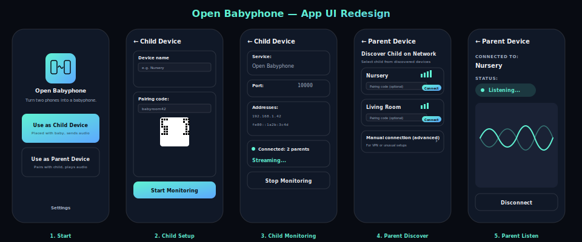

# Open Babyphone — App UI Redesign

This document captures the Open Design brand-based redesign of the Open Babyphone
Android app. It is a design handoff snapshot; the rendered mockups live in
`app-ui-redesign.html` (open in a browser).

## Brand palette

| Role | Token | Hex |
| --- | --- | --- |
| background (dark) | Night monitor canvas | `#080B12` |
| surface (dark) | Deep panel | `#101827` |
| foreground (dark) | Soft white text | `#F6F7FB` |
| muted (dark) | Quiet blue-grey | `#A5B2C8` |
| accent (live audio) | Live audio cyan | `#5FF2D2` |
| accent (network) | Network blue | `#5DA8FF` |
| background (light) | Soft white | `#F6F7FB` |
| foreground (light) | Deep panel | `#101827` |

## Layout tokens

- Radius: 8px (controls), 12px (mark), 28px (phone/large cards)
- Border: 1px translucent hairline
- Spacing: 2 / 4 / 8 / 12 / 16 / 24 / 32 dp

## Compose mapping

| OD concept | Compose target |
| --- | --- |
| Night canvas background | `ColorScheme.background` (dark) |
| Deep panel surface | `ColorScheme.surface` (dark) |
| Soft white text | `ColorScheme.onBackground` / `onSurface` (dark) |
| Quiet blue-grey muted | `ColorScheme.onSurfaceVariant` |
| Live audio cyan | `ColorScheme.primary` |
| Network blue | `ColorScheme.secondary` |
| Status pill + pulse dot | `ListenScreen` status row, `MonitorScreen` monitoring card |
| Waveform hero | `ListenScreen` `VolumeCanvas` |
| QR code card | `MonitorScreen` setup section |
| Paired CTA cards | `StartScreen` |

## Screens covered

1. Start — brand logo tile, tagline, two CTA cards
2. Child Setup — device name, pairing code + QR, Start Monitoring
3. Child Monitoring — service/port/addresses, status pill, Stop Monitoring
4. Parent Discover — discovery list, signal bars, advanced manual section
5. Parent Listen — status pill, waveform hero, Disconnect

## Note

Android 12+ dynamic color is disabled by default so the brand palette is stable.
A future "Use system colors" setting is tracked in issue #137.

## Preview

